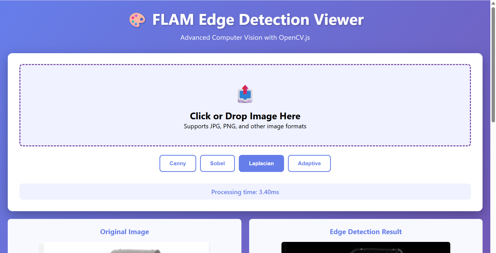
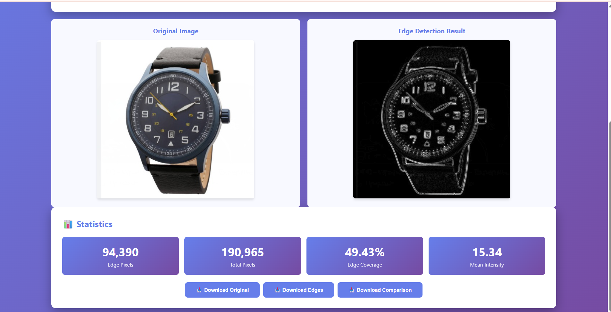

# 🎨 Real-Time Edge Detection Viewer

An Android application that performs real-time edge detection using OpenCV and renders results with OpenGL ES, with a TypeScript-based web viewer for frame analysis.


---

## 📋 Project Overview

This project demonstrates integration of:
- Android Camera API for frame capture
- OpenCV (C++) for image processing via JNI
- OpenGL ES for hardware-accelerated rendering
- TypeScript web viewer for frame analysis

---

## Features Implemented

Edge Detection Methods

Select from 4 different algorithms
Canny: Adjustable thresholds with sliders
Sobel, Laplacian, Adaptive: One-click processing


Real-time Statistics

Edge pixels count
Total pixels
Edge coverage percentage
Mean intensity value
Processing time


Export Options

Download original image
Download edge-detected image
Download side-by-side comparison
PNG format with labels

## Screenshots 




## 🏗️ Project Structure
```
flam-edge-detection/
├── app/                          # Android application
│   ├── src/main/
│   │   ├── cpp/                 # C++ native code
│   │   │   ├── native-lib.cpp  # JNI implementation
│   │   │   └── CMakeLists.txt  # CMake configuration
│   │   ├── java/com/flam/edgedetection/
│   │   │   ├── camera/         # Camera handling
│   │   │   ├── gl/             # OpenGL rendering
│   │   │   └── jni/            # JNI interfaces
│   │   └── res/                # Android resources
│   └── build.gradle.kts        # App-level Gradle config
├── opencv/                      # OpenCV Android SDK
├── web/                         # TypeScript web viewer
│   ├── src/
│   │   ├── app.ts             # Main TypeScript code
│   │   ├── index.html         # Web UI
│   │   └── styles.css         # Styling
│   ├── dist/                   # Compiled JavaScript
│   └── package.json           # npm configuration
└── README.md                   # This file
```

---

## ⚙️ Setup Instructions

### Prerequisites
- Android Studio Arctic Fox or newer
- Android SDK API 24+
- NDK version 25.1.8937393 or newer
- OpenCV 4.9.0 for Android
- Node.js 18+ and npm
- Git

### Android App Setup

1. **Clone the repository**
```bash
   git clone https://github.com/dhruva1311/flam-edge-detection-viewer.git
   cd flam-edge-detection-viewer
```

2. **Open in Android Studio**
   - File → Open → Select project directory
   - Wait for Gradle sync to complete

3. **Download OpenCV** (if not included)
   - Download from https://opencv.org/releases/
   - Extract and place in project root as `opencv/`

4. **Build the project**
```bash
   ./gradlew build
```

5. **Run on device/emulator**
   - Connect Android device or start emulator
   - Click Run button in Android Studio

### Web Viewer Setup

1. **Navigate to web directory**
```bash
   cd web
```

2. **Install dependencies**
```bash
   npm install
```

3. **Build TypeScript**
```bash
   npm run build
```

4. **Serve locally**
```bash
   npm run serve
```

5. **Open in browser**
   - Navigate to `http://localhost:8000/`

---

## 🧠 Architecture

### Data Flow
```
Camera → Java/Kotlin → JNI → C++ OpenCV → JNI → OpenGL → Display
                                           ↓
                                      Web Viewer (Export)
```

### JNI Communication

1. **Java → C++**: Frame data passed as byte array
2. **C++ Processing**: OpenCV applies edge detection
3. **C++ → Java**: Processed frame returned
4. **OpenGL**: Renders frame as texture

### Frame Processing Pipeline
```
[Camera Frame] → [YUV to RGB] → [Edge Detection] → [RGB to Texture] → [Display]
```

---

## 🛠️ Tech Stack

| Component | Technology | Version |
|-----------|-----------|---------|
| Android | Kotlin | 1.9.x |
| Native | C++ | 17 |
| Image Processing | OpenCV | 4.9.0 |
| Graphics | OpenGL ES | 2.0+ |
| Build | CMake | 3.22.1 |
| Web | TypeScript | 5.3.x |
| UI | HTML/CSS | - |

---

## 🚀 Development Progress

### Completed
- ✅ Initial project setup
- ✅ NDK and OpenCV integration
- ✅ CMake configuration
- ✅ TypeScript web viewer skeleton
- ✅ Project structure organization


## 📊 Performance Targets

- **Frame Rate**: 10-15 FPS minimum
- **Processing Time**: < 100ms per frame
- **Memory**: < 200MB total usage

---

## 🐛 Known Issues

_None yet 

---

## 📚 References

- [OpenCV Android Documentation](https://docs.opencv.org/4.9.0/d0/d4e/tutorial_table_of_content_android.html)
- [Android NDK Guide](https://developer.android.com/ndk/guides)
- [OpenGL ES 2.0 Tutorial](https://developer.android.com/develop/ui/views/graphics/opengl)
- [JNI Best Practices](https://developer.android.com/training/articles/perf-jni)

---

## 👤 Author

DHRUVA R PRASAD 
Batch: 2026  
Email: dhruvarprasad@gmail.com  
GitHub: [@dhruva1311](https://github.com/dhruva1311)

---
Last Updated: November 13, 2025  
Status: Initial Setup Complete ✓